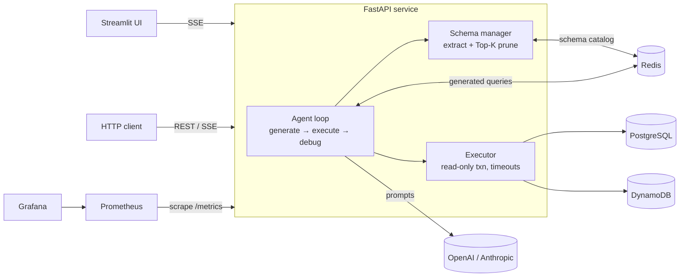

# LuminaSQL-Agent

[](https://github.com/amberfxy/lumina-sql-agent/actions/workflows/ci.yml)

Self-hosted NL→SQL/PartiQL agent for **PostgreSQL** and **AWS DynamoDB**, with a **self-correcting execution loop**.

Ask a question in natural language → the agent prunes the schema to relevant tables → generates SQL or PartiQL → executes it → on failure, feeds the raw database error back to the model and retries (default max 3). Around that core loop the repo ships the production plumbing: Redis caching, Prometheus metrics and alerts, a Grafana dashboard, Docker Compose, Kubernetes manifests, a concurrent evaluation harness, and CI.

## Architecture



## Features

**Agent**
- Dual backends: PostgreSQL (SQL) and DynamoDB (PartiQL via `execute_statement`)
- Schema-aware generation: live metadata extraction (tables, columns, PK/FK, types, table comments) with Top-K lexical pruning (snake_case splitting + plural folding, cosine ranking)
- Self-correcting loop: execution errors go back to the model through a dedicated debug prompt
- Streaming: SSE events for schema, LLM tokens, queries, errors, and results; blocking LLM/DB work runs in worker threads so streams never stall the event loop
- Pluggable LLM clients (OpenAI, any OpenAI-compatible endpoint, Anthropic)

**Safety and reliability**
- Defense in depth for read-only mode: keyword filter plus a PostgreSQL `READ ONLY` transaction, which also blocks side-effecting calls such as `nextval()` that the filter misses
- Per-statement timeout, connection timeouts, bounded connection pool, row cap
- Thread-safe lazy initialization of engines and caches
- `/livez` and `/readyz` probes; the API starts and passes liveness without LLM credentials and returns `503` for queries until they are configured

**Caching (Redis, optional)**
- Schema catalogs shared across replicas (TTL), so pods do not each re-inspect the database
- Generated queries keyed by (backend, model, normalized question, pruned schema); a schema change changes the key, and a cached query that fails is evicted and regenerated
- Graceful degradation: on Redis errors the cache is bypassed for a cooldown window instead of adding a timeout to every request

**Observability**
- Prometheus metrics: HTTP rate/latency by route template, agent outcomes (success, self-corrected, cache hit, failed), execution attempts, LLM latency by phase, DB latency, cache hit/miss/error
- 8 alert rules (API down, 5xx ratio, agent failure rate, p95 latency, self-correction spike, LLM errors, cache unavailable, DB latency)
- Provisioned Grafana dashboard

## Quick start (Docker Compose)

```bash
cp .env.example .env          # add OPENAI_API_KEY (or ANTHROPIC_API_KEY + LLM_PROVIDER=anthropic)
make up                       # API :8000, UI :8501, Postgres (seeded demo data), Redis
make up-all                   # + Prometheus :9090, Grafana :3000, DynamoDB Local :8001
```

The Postgres container is seeded from `db/init/` with a deterministic e-commerce dataset: 7 tables (categories, products, customers, employees, orders, order items, support tickets) and about 11,000 rows.

```bash
curl -X POST localhost:8000/api/v1/query -H 'Content-Type: application/json' \
  -d '{"query": "Top 5 customers by revenue from delivered orders"}'
```

## API

| Method | Path | Description |
|--------|------|-------------|
| `GET` | `/livez` | Liveness |
| `GET` | `/readyz` | Readiness (`503` until a database backend is reachable) |
| `GET` | `/health` | Postgres, DynamoDB, and Redis status |
| `GET` | `/metrics` | Prometheus metrics |
| `POST` | `/api/v1/query` | Synchronous query → `AgentResult` |
| `POST` | `/api/v1/query/stream` | SSE stream (`status`, `schema`, `llm_token`, `query`, `error`, `result`) |
| `POST` | `/api/v1/cache/invalidate` | Drop cached schemas and generated queries |

## Evaluation

`evaluation/` contains 58 hand-written questions (17 easy, 22 medium, 19 hard: joins, `HAVING`, window functions, `DISTINCT ON`, date math) with gold SQL over the seeded database. The harness runs cases concurrently (asyncio + bounded semaphore over a thread pool) and scores **execution accuracy**: a prediction is correct when some injective mapping of its result columns reproduces the gold rows (column order and extra columns tolerated, numbers compared at 2 decimals, row order enforced only for ordered questions).

```bash
make eval                           # needs an LLM key in .env
make validate-gold                  # dataset integrity only, no LLM calls (also runs in CI)
```

Each run reports execution accuracy, first-attempt accuracy (what you would get without self-correction), valid-SQL rate, cases recovered by self-correction, LLM calls per question, p50/p95 latency, and throughput, broken down by difficulty. Results are written to `evaluation/results/`.

## Kubernetes

`deploy/k8s/` (Kustomize): Postgres StatefulSet with a PVC, Redis, and the API as a 2-replica Deployment with startup/liveness/readiness probes, `maxUnavailable: 0` rolling updates, a `preStop` drain, a PodDisruptionBudget, an HPA, and a hardened pod security context (non-root, read-only root filesystem, all capabilities dropped, seccomp `RuntimeDefault`).

```bash
make k8s-up        # kind cluster + image load + apply + wait for rollouts
make k8s-status
make k8s-down
```

Verified locally on kind: 652 in-cluster requests during `kubectl rollout restart` with 0 failures.

## Testing and CI

```bash
make test          # unit + integration tests against the compose Postgres/Redis
make lint          # ruff check + format
```

Unit tests use fake LLM/DB clients (no network). Integration tests hit the seeded Postgres and a real Redis: schema/FK/comment extraction, the read-only transaction, statement timeouts, gold-query validation, and cache round trips.

GitHub Actions runs lint, unit tests with coverage, integration tests against Postgres/Redis service containers, config validation (`promtool`, `kubectl kustomize`, `docker compose config`), and an image build with a container smoke test.

## Configuration

See `.env.example`. Notable variables:

| Variable | Default | Notes |
|----------|---------|-------|
| `LLM_PROVIDER` | `openai` | `openai` or `anthropic` |
| `OPENAI_MODEL` / `OPENAI_BASE_URL` | `gpt-4o` / unset | Base URL enables OpenAI-compatible providers |
| `MAX_RETRY_ITERATIONS` | `3` | Self-correction attempts (1–10) |
| `REDIS_URL` | unset | Caching is disabled when unset |
| `POSTGRES_STATEMENT_TIMEOUT_MS` | `15000` | Applied to every connection |
| `DYNAMODB_ENDPOINT_URL` | unset | Set for DynamoDB Local |

## Project layout

```
api/            FastAPI app, probes, metrics endpoint, middleware
src/            agent loop, schema manager, executor, Redis cache, metrics
evaluation/     gold dataset, comparator, concurrent runner
db/init/        schema + deterministic seed data
tests/          unit and integration tests
deploy/k8s/     Kustomize manifests
observability/  Prometheus config, alert rules, Grafana provisioning
```

## Limitations

- Schema pruning is lexical (bag-of-words cosine), not embedding-based
- The keyword filter is a first line of defense; the read-only transaction is the real guard on PostgreSQL, while DynamoDB relies on the filter plus IAM
- No authentication, rate limiting, or multi-tenancy
- The evaluation set is small and single-database; it measures regressions, not general NL2SQL ability
