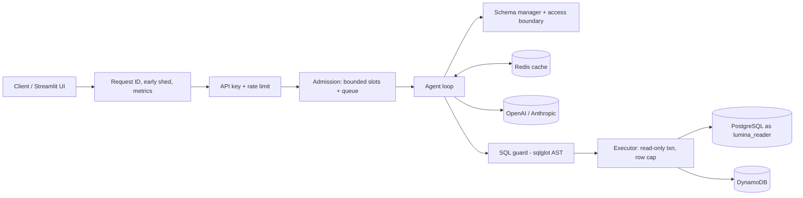

# LuminaSQL-Agent

[](https://github.com/amberfxy/lumina-sql-agent/actions/workflows/ci.yml)

Self-hosted natural-language-to-SQL agent for **PostgreSQL** (and PartiQL for **DynamoDB**)
built around one question: *what does it take to let an LLM run queries against a real
database safely, predictably, and measurably?*

The agent prunes the schema to relevant tables, generates a query, validates it
structurally, executes it read-only, and classifies any failure. Only failures the model
can fix (syntax errors, hallucinated tables or columns) go back to it; infrastructure
blips are retried without the model; unsafe queries stop immediately.

| | Measured (reproducible, see [docs/evaluation.md](docs/evaluation.md)) |
| --- | --- |
| SQL guard | 68/68 adversarial payloads rejected across 15 techniques, 0/61 false positives on gold queries |
| Defense in depth | Read-only DB role blocks 5/5 audit bypass payloads even with the guard disabled |
| Failure semantics | 30/30 deterministic agent scenarios (LLM faults, hallucinations, unsafe output, timeouts) |
| Capacity (1 vCPU replica, mock LLM 400 ms) | about 180-200 req/s at saturation; knee between 100 and 150 concurrent requests |
| Query cache | hit p50 2.6 ms vs 408 ms uncached, 0 LLM tokens; miss overhead within noise |
| Disruption (kind, 2 replicas) | 0/4500 failed requests across 3 rolling restarts (preStop drain); 9/1500 on a hard SIGKILL |
| Tests | 287 passing, 90% line coverage (unit + Postgres/Redis/DynamoDB Local integration) |

Real-model accuracy is **not** reported yet: the harness and 97-case dataset are ready
(`make eval`), but no run with an API key has been done.

## Architecture



Details: [architecture](docs/architecture.md) · [security](docs/security.md) ·
[failure model](docs/failure-model.md) · [evaluation](docs/evaluation.md) ·
[runbook](docs/runbook.md) · [audit](docs/production-ai-audit.md)

## What makes it production-shaped

- **Safety in three layers:** an AST guard (single `SELECT`, no DDL/DML/`COPY`/`SET`/locks,
  function denylist, system catalogs and foreign schemas blocked, denied columns), a
  least-privilege `lumina_reader` role with `default_transaction_read_only`, and a per-session
  `READ ONLY` transaction with a row cap and statement timeout. Mutations need a server-side
  flag; a client cannot enable them.
- **Prompt-injection hygiene:** user text, schema, and DB errors are delimited as untrusted
  data, and the model has an explicit `CANNOT_ANSWER:` refusal channel.
- **Failure taxonomy:** 14 categories, each with a policy (LLM-correctable, transient,
  terminal) and an HTTP mapping (`200 success:false` for answers, `502/503/504` for
  dependencies).
- **Bounded latency:** an agent deadline, an LLM timeout derived from the remaining deadline,
  pool and statement timeouts.
- **Backpressure:** bounded concurrency and queue per replica, early `429` + `Retry-After`,
  optional API keys and per-client token buckets.
- **Observability:** one request ID across HTTP, logs, the LLM call, and the SQL comment;
  Prometheus metrics for tokens, cost, failures by category, unsafe rejections by layer,
  in-flight and queued requests, and admission wait; 15 alert rules; a Grafana dashboard.
- **Deployment:** Compose and Kubernetes (rolling updates with `maxUnavailable: 0`,
  `preStop`, PDB, HPA, NetworkPolicy, hardened pod security context).

## Quick start

```bash
cp .env.example .env          # add OPENAI_API_KEY (or ANTHROPIC_API_KEY + LLM_PROVIDER=anthropic)
make up                       # API :8000, UI :8501, Postgres (seeded), Redis
make up-all                   # + Prometheus :9090, Grafana :3000, DynamoDB Local :8001

curl -X POST localhost:8000/api/v1/query -H 'Content-Type: application/json' \
  -d '{"query": "Top 5 customers by revenue from delivered orders"}'
```

The database is seeded from `db/init/` with a deterministic e-commerce dataset: 7 tables
(categories, products, customers, employees, orders, order items, support tickets) and
about 11,000 rows.

No API key? `make loadtest-up` starts the stack against a mock LLM on `:8002`.

## API

| Method | Path | Description |
|--------|------|-------------|
| `GET` | `/livez`, `/readyz`, `/health` | Liveness, readiness, dependency status |
| `GET` | `/metrics` | Prometheus metrics |
| `POST` | `/api/v1/query` | Run the agent; returns rows, the final query, attempts, `failure`, `usage`, `request_id` |
| `POST` | `/api/v1/query/stream` | SSE stream (`status`, `schema`, `llm_token`, `query`, `error`, `result`) |
| `POST` | `/api/v1/cache/invalidate` | Drop cached schemas and generated queries (authenticated) |

## Evaluation and benchmarks

```bash
make eval-guard        # SQL guard vs 68 adversarial payloads + gold false positives (no LLM)
make validate-gold     # every gold query executes and returns rows
make eval-scripted     # 30 deterministic agent scenarios against real Postgres
make eval              # real model on the 97-case categorized dataset (needs a key)
make eval-single-shot  # same with self-correction off, for the ablation

make loadtest-up && make loadtest   # concurrency sweep on a 1-CPU API
make bench-cache                    # cache hit vs miss
make resilience                     # LLM 429/500/timeout/malformed, Postgres down, Redis down
make k8s-up K8S_DIR=deploy/k8s-testing && make k8s-disruption
```

Methodology, datasets, metric definitions, and all measured numbers are in
[docs/evaluation.md](docs/evaluation.md); raw reports are in `eval/results/`.

## Testing and CI

`make test` runs unit tests (fake LLM/DB) and integration tests (seeded Postgres, Redis,
the read-only role). GitHub Actions runs lint, unit tests with coverage, a security job
(guard tests and the adversarial suite), integration tests as `lumina_reader` with gold
validation and the scripted suite, config validation (`promtool`, dashboard JSON, Compose),
a container end-to-end test through the mock LLM, and a kind job that deploys the manifests,
checks the NetworkPolicy, and does a rolling restart under traffic. The paid real-model
eval is a separate manually dispatched workflow.

## Configuration

See `.env.example` and `config.py`. Notable variables:

| Variable | Default | Notes |
|----------|---------|-------|
| `LLM_PROVIDER` | `openai` | `openai` or `anthropic`; `OPENAI_BASE_URL` enables compatible providers |
| `MAX_RETRY_ITERATIONS` | `3` | Generation attempts per question |
| `AGENT_DEADLINE_SECONDS` | `90` | End-to-end budget; LLM timeouts are derived from it |
| `MAX_CONCURRENT_REQUESTS` / `MAX_QUEUED_REQUESTS` | `16` / `32` | Per replica; size against the provider quota |
| `RATE_LIMIT_PER_MINUTE` / `API_KEYS` | off | Per-client limit; comma-separated keys |
| `MUTATIONS_ENABLED` | `false` | Server-side gate for `allow_mutations` |
| `ALLOWED_TABLES` / `DENIED_COLUMNS` | all / none | Schema boundary for the model and the guard |
| `POSTGRES_USER` | `lumina_reader` (Compose, k8s) | Least-privilege role from `db/init/00_roles.sql` |
| `REDIS_URL` | unset | Caching is disabled when unset |
| `LLM_INPUT_COST_PER_1M_TOKENS` / `..._OUTPUT_...` | `2.50` / `10.00` | Used for cost estimates |

## Project layout

```
api/              FastAPI app: middleware, auth, admission, status mapping
src/              agent, SQL guard, failure taxonomy, admission, executor, schema manager, cache, metrics
eval/             datasets, harness, comparator, scripted LLM, committed results
scripts/          run_eval, mock LLM, load test, cache benchmark, resilience, k8s disruption
db/init/          roles, schema, deterministic seed data, grants
tests/            unit and integration tests
deploy/k8s/       Kustomize manifests; deploy/k8s-testing adds an in-cluster mock LLM
observability/    Prometheus config, alert rules, Grafana dashboard
docs/             architecture, security, failure model, evaluation, runbook, audit
```

## Limitations

- No real-model accuracy numbers yet (needs an API key; see above).
- Performance numbers use a mock LLM on a shared laptop Docker VM: they measure the
  service's own overhead and saturation behavior, not end-user latency with a real model.
- Rate limits and admission control are per replica; global quotas need the ingress or a
  shared store.
- Schema pruning is lexical, which is enough for small schemas but not hundreds of tables.
- Single-tenant: no row-level security or per-user data scoping.
