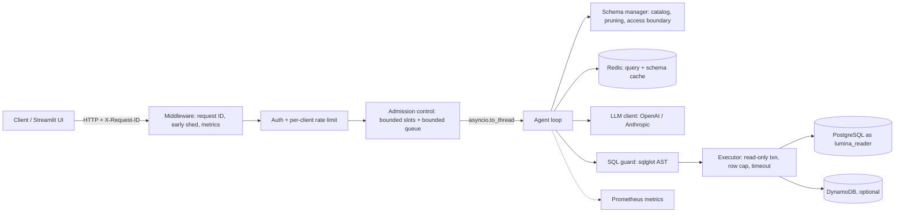

# Architecture

LuminaSQL turns a natural-language question into a validated, read-only SQL (PostgreSQL)
or PartiQL (DynamoDB) query, executes it, and returns rows plus a structured trace. The
design goal is a small number of moving parts with explicit failure semantics, not a
framework stack.

## Components

| Module | Responsibility |
| --- | --- |
| `api/main.py` | FastAPI app: request IDs, early load shedding, auth, rate limiting, admission, HTTP status mapping |
| `src/admission.py` | `AdmissionController` (semaphore + bounded wait queue + queue timeout), `RateLimiter` (token bucket) |
| `src/agent.py` | Generate, validate, execute, classify, and retry; token/cost accounting; prompts |
| `src/sql_guard.py` | Structural SQL/PartiQL validation (see `docs/security.md`) |
| `src/failures.py` | Failure taxonomy, retry policies, error classifiers (see `docs/failure-model.md`) |
| `src/db_executor.py` | Pooled PostgreSQL / DynamoDB execution with read-only enforcement and row limits |
| `src/schema_manager.py` | Schema introspection, keyword-based pruning, `ALLOWED_TABLES` / `DENIED_COLUMNS` |
| `src/cache.py` | Best-effort Redis cache with failure cooldown |
| `src/context.py` | Request-ID context variable and JSON logging |
| `src/metrics.py` | Prometheus metric definitions |

## Request lifecycle

1. **Middleware** assigns or accepts `X-Request-ID` (validated, max 64 chars), stores it in a
   context variable, and, if the admission queue is already full, returns `429` with
   `Retry-After` *before* body parsing or routing.
2. **Auth and rate limit**: optional API key (`X-API-Key` or Bearer), then a per-client
   token bucket.
3. **Admission**: wait for one of `MAX_CONCURRENT_REQUESTS` slots; at most
   `MAX_QUEUED_REQUESTS` may wait, each for at most `QUEUE_TIMEOUT_SECONDS`.
4. **Agent run** in a worker thread (the default executor is sized to the slot count):
   1. Load the table catalog. Empty means `SCHEMA_UNAVAILABLE`.
   2. Prune the schema to tables relevant to the question.
   3. On a cache hit, the cached SQL is re-validated and executed (results are never cached).
   4. Otherwise call the LLM with a per-call timeout derived from the remaining deadline.
   5. Parse: a `CANNOT_ANSWER:` refusal ends the run as `UNANSWERABLE`; missing SQL is `MALFORMED_OUTPUT`.
   6. Guard-validate, then execute with transient retries (same SQL, backoff, no LLM).
   7. Classify failures. Only `llm_correctable` categories go back to the model, up to
      `MAX_RETRY_ITERATIONS` attempts and `AGENT_DEADLINE_SECONDS`.
5. **Response**: request-level outcomes (answered, refused, unfixable) are `200` with
   `success: false` and a `failure` object; dependency failures map to `502/503/504` so
   load balancers and alerts can see them.

The streaming endpoint (`/api/v1/query/stream`) runs the same generator and emits
Server-Sent Events (status, schema, LLM tokens, query, result).

## Correlation

One request ID follows the request through every layer:

| Layer | Where the ID appears |
| --- | --- |
| HTTP | `X-Request-ID` response header |
| Logs | `request_id` field (`LOG_FORMAT=json`) |
| LLM | `X-Request-ID` header on OpenAI calls |
| Database | `/* request_id=... */` prefix on every statement (visible in `pg_stat_activity`) |
| Response | `request_id` in the JSON body |

## Deployment

- **Compose** (`docker-compose.yml`): API, UI, PostgreSQL (seeded by `db/init`), Redis;
  profiles for observability (Prometheus, Grafana), DynamoDB Local, and `loadtest`
  (mock LLM and a second API pinned to 1 CPU / 512 MB, the same limits as the k8s pod).
- **Kubernetes** (`deploy/k8s`): 2+ API replicas, `maxUnavailable: 0` rolling updates,
  `preStop` delay, `terminationGracePeriodSeconds` covering the agent deadline, a PDB,
  a CPU-based HPA, a PostgreSQL StatefulSet, Redis, and NetworkPolicies restricting the
  data stores to API pods. `deploy/k8s-testing` adds an in-cluster mock LLM for CI and
  disruption tests.

## Deliberate non-choices

- **No agent framework.** The loop is ~200 lines with explicit policies; a framework
  would hide the retry and safety semantics this project is about.
- **No vector store for schema retrieval.** Keyword pruning is enough for a
  7-table schema; revisit when schemas reach hundreds of tables.
- **No result caching.** Only generated SQL is cached, so cached answers never serve
  stale data.
- **In-process limits.** Rate limiting and admission are per replica. A global quota
  needs a shared limiter (ingress or Redis); see `docs/runbook.md`.
